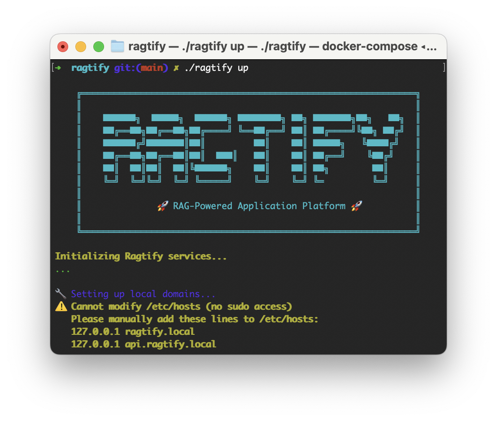

<table>
  <tr>
    <td width="400" style="vertical-align: top; border-width: 0px;">
      
    </td>
    <td style="vertical-align: top; border-width: 0px;">
            <svg data-logo="logo" xmlns="http://www.w3.org/2000/svg" viewBox="0 0 165 42" width="165" height="42">
         <g id="logogram" transform="translate(0, 4) rotate(0)"><path d="M15.4992 0H36.5808L21.0816 22.9729H0L15.4992 0Z" fill="#007AFF"/><path d="M16.4224 25.102L10.4192 34H32.5008L48 11.0271H31.7024L22.2064 25.102H16.4224Z" fill="#312ECB"/></g>
         <g id="logotype" transform="translate(54, 1)"><path fill="currentColor" d="M12.13 33L7.40 33L7.40 14.80L11.98 14.80L11.98 18.27Q12.44 16.30 13.84 15.27Q15.24 14.24 17.62 14.38L17.62 14.38L17.62 18.82L16.96 18.82Q14.93 18.82 13.53 20.12Q12.13 21.41 12.13 23.69L12.13 23.69L12.13 33ZM26.62 33.45L26.62 33.45Q24.13 33.45 22.08 32.18Q20.04 30.90 18.83 28.75Q17.62 26.59 17.62 23.97L17.62 23.97Q17.62 22.01 18.32 20.28Q19.02 18.54 20.25 17.23Q21.47 15.92 23.10 15.17Q24.73 14.41 26.62 14.41L26.62 14.41Q29.00 14.41 30.33 15.31Q31.66 16.20 32.39 17.67L32.39 17.67L32.39 14.80L37.08 14.80L37.08 33L32.50 33L32.50 30.02Q31.76 31.57 30.41 32.51Q29.07 33.45 26.62 33.45ZM27.39 29.18L27.39 29.18Q28.96 29.18 30.10 28.47Q31.24 27.75 31.87 26.56Q32.50 25.37 32.50 23.97L32.50 23.97Q32.50 22.53 31.87 21.34Q31.24 20.16 30.10 19.42Q28.96 18.68 27.39 18.68L27.39 18.68Q25.88 18.68 24.74 19.40Q23.61 20.12 22.98 21.31Q22.35 22.50 22.35 23.93L22.35 23.93Q22.35 25.30 22.98 26.51Q23.61 27.71 24.74 28.45Q25.88 29.18 27.39 29.18ZM48.74 40.45L48.74 40.45Q45.97 40.45 43.82 39.70Q41.67 38.95 40.02 37.02L40.02 37.02L42.96 33.56Q44.26 35.03 45.66 35.55Q47.06 36.08 48.77 36.08L48.77 36.08Q50.03 36.08 51.12 35.45Q52.20 34.82 52.85 33.68Q53.50 32.55 53.50 31.11L53.50 31.11L53.50 30.30Q52.76 31.57 51.48 32.34Q50.21 33.10 48.00 33.10L48.00 33.10Q45.52 33.10 43.50 31.84Q41.49 30.59 40.34 28.47Q39.18 26.35 39.18 23.73L39.18 23.73Q39.18 21.10 40.34 18.96Q41.49 16.83 43.50 15.59Q45.52 14.34 48.00 14.34L48.00 14.34Q50.28 14.34 51.55 15.15Q52.83 15.95 53.57 17.28L53.57 17.28L53.57 14.80L58.22 14.80L58.22 31.39Q58.22 34.19 57.01 36.22Q55.81 38.25 53.67 39.35Q51.54 40.45 48.74 40.45ZM48.77 28.80L48.77 28.80Q51.12 28.80 52.41 27.33Q53.71 25.86 53.71 23.73L53.71 23.73Q53.71 21.59 52.41 20.12Q51.12 18.65 48.77 18.65L48.77 18.65Q46.46 18.65 45.18 20.12Q43.91 21.59 43.91 23.73L43.91 23.73Q43.91 25.09 44.48 26.24Q45.06 27.40 46.15 28.10Q47.23 28.80 48.77 28.80ZM70.51 33L67.92 33Q65.22 33 63.79 31.67Q62.35 30.34 62.35 27.36L62.35 27.36L62.35 18.82L59.80 18.82L59.80 14.80L62.35 14.80L62.35 11.12L67.08 10.63L67.08 14.80L70.93 14.80L70.93 18.82L67.08 18.82L67.08 27.12Q67.08 28.80 68.55 28.80L68.55 28.80L70.51 28.80L70.51 33ZM74.85 13.29L74.85 13.29Q73.66 13.29 72.83 12.47Q72.01 11.65 72.01 10.49L72.01 10.49Q72.01 9.37 72.83 8.55Q73.66 7.73 74.85 7.73L74.85 7.73Q76.07 7.73 76.88 8.55Q77.68 9.37 77.68 10.49L77.68 10.49Q77.68 11.68 76.88 12.49Q76.07 13.29 74.85 13.29ZM77.23 33L72.50 33L72.50 14.80L77.23 14.80L77.23 33ZM86.08 33L81.36 33L81.36 18.82L78.80 18.82L78.80 14.80L81.36 14.80L81.36 13.57Q81.36 10.81 83.00 9.13Q84.65 7.45 87.41 7.45L87.41 7.45L89.37 7.45L89.37 11.47L88.15 11.47Q86.08 11.47 86.08 13.64L86.08 13.64L86.08 14.80L89.79 14.80L89.79 18.82L86.08 18.82L86.08 33ZM93.61 40.31L93.61 40.31Q92.91 40.31 92.03 40.25Q91.16 40.17 90.46 39.97L90.46 39.97L91.16 35.45Q92.14 35.70 93.29 35.70L93.29 35.70Q94.66 35.70 95.53 34.91Q96.41 34.12 96.79 32.93L96.79 32.93L97.04 32.16L89.83 14.80L95.53 14.80L99.07 25.20Q99.56 26.59 99.84 28.10L99.84 28.10Q100.12 26.59 100.61 25.20L100.61 25.20L104.14 14.80L109.74 14.80L101.69 34.16Q100.54 36.92 98.68 38.62Q96.83 40.31 93.61 40.31Z"/></g>
       </svg>
      <h3>A barebones setup to quick start RAG app development in Python</h3>
      <p>
        ragtify cuts through the noise, providing a minimal, pre-configured foundation for your next RAG project. By orchestrating <strong>Ollama</strong>, <strong>Qdrant</strong>, and a modern <strong>React + FastAPI</strong> stack, it eliminates boilerplate fatigue so you can focus immediately on building and experimenting with your RAG pipelines.
      </p>
    </td>
  </tr>
</table>

---

## 📋 Prerequisites

Before you begin, ensure you have the following installed:

- **Docker:** [Get Docker](https://docs.docker.com/get-docker/) (Docker Desktop recommended for Mac/Windows)

## ⚡️ Quick Start

Get up and running in seconds.

### 1. Launch ragtify
Run the magic script to start all services, set up local domains, and run migrations:

```bash
./ragtify up
```

### 2. Access the Platform
Once the services are initialized, open your browser and visit:

👉 **[http://ragtify.local:3001](http://ragtify.local:3001)**

### 3. Explore
- **Frontend (Chat & Settings):** [http://ragtify.local:3001](http://ragtify.local:3001)
- **Backend API:** [http://api.ragtify.local:8000](http://api.ragtify.local:8000)
- **API Documentation:** [http://api.ragtify.local:8000/docs](http://api.ragtify.local:8000/docs)

---

## 🛠 Command Line Interface

The included `ragtify` script is your control center.

| Command | Description |
|---------|-------------|
| `./ragtify up` | Start all services |
| `./ragtify down` | Stop all services safely |
| `./ragtify ui` | Render the React UI changes |
| `./ragtify logs` | View real-time logs for all containers |
| `./ragtify status` | Check the health of your stack |
| `./ragtify migrate` | Run database migrations manually |
| `./ragtify build` | Rebuild services from scratch |

---

## 🏗 Architecture

ragtify is built with a modular, production-ready stack:

- **Frontend:** React 18 with Tailwind CSS (Dark Mode enabled! 🌙)
- **Backend:** FastAPI (Python) for high-performance async APIs
- **AI Engine:** Ollama (Local LLMs like Llama 3)
- **Vector DB:** Qdrant for semantic search
- **Database:** MySQL for structured data

## 📝 License

MIT
